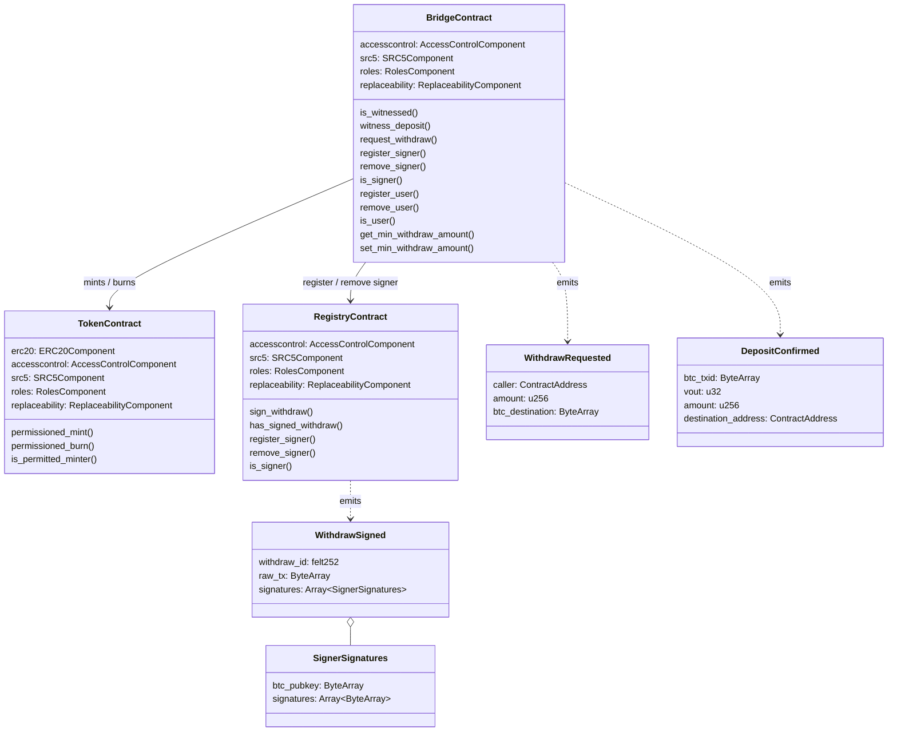

# strkBTC Bridge - Specs

## Diagram



---

## Token Contract

The `strkBTC` token is an ERC-20 token on Starknet representing wrapped Bitcoin. It is
minted when a BTC deposit is confirmed by the bridge and burned when a user requests a
BTC withdrawal.

### Constants

| Name | Value | Description |
|------|-------|-------------|
| `NAME` | `'strkBTC'` | ERC-20 token name |
| `SYMBOL` | `'strkBTC'` | ERC-20 token symbol |
| `DECIMALS` | `8` | Matches Bitcoin's native precision |

### Storage

The token contract extends standard OpenZeppelin components and adds no custom storage
fields of its own. All balances and allowances are held in `ERC20Component::Storage`.

```rust
struct Storage {
    erc20: ERC20Component::Storage,
    accesscontrol: AccessControlComponent::Storage,
    src5: SRC5Component::Storage,
    roles: RolesComponent::Storage,
    replaceability: ReplaceabilityComponent::Storage,
}
```

### Components

| Component | Purpose |
|-----------|---------|
| `ERC20Component` | Standard fungible token (balances, allowances, transfer, approve) |
| `AccessControlComponent` | Low-level role storage used by `RolesComponent` |
| `SRC5Component` | Interface introspection (ERC-165 equivalent) |
| `RolesComponent` | Governance and operator role management |
| `ReplaceabilityComponent` | Upgradeable contract pattern with time-locked implementation replacement |

### Constructor

```rust
fn constructor(
    ref self: ContractState,
    governance_admin: ContractAddress,
    upgrade_delay: u64,
)
```

#### Logic

1. Initializes `RolesComponent` with `governance_admin` as the first governance admin.
2. Initializes `ReplaceabilityComponent` with the given `upgrade_delay`.
3. Initializes the ERC-20 metadata with `name = "strkBTC"` and `symbol = "strkBTC"`.

### Functions

#### permissioned_mint

```rust
fn permissioned_mint(ref self: ContractState, account: ContractAddress, amount: u256)
```

Mints `amount` tokens to `account`.

##### Access

Only callable by an address with the `TOKEN_ADMIN` role.

##### Logic

1. Asserts the caller holds `TOKEN_ADMIN` via `roles.only_token_admin()`.
2. Calls `erc20.mint(account, amount)`.

---

#### permissioned_burn

```rust
fn permissioned_burn(ref self: ContractState, account: ContractAddress, amount: u256)
```

Burns `amount` tokens from `account`.

##### Access

Only callable by an address with the `TOKEN_ADMIN` role.

##### Logic

1. Asserts the caller holds `TOKEN_ADMIN` via `roles.only_token_admin()`.
2. Calls `erc20.burn(account, amount)`.

---

#### is_permitted_minter

```rust
fn is_permitted_minter(self: @ContractState, account: ContractAddress) -> bool
```

Returns `true` if `account` holds the `TOKEN_ADMIN` role, `false` otherwise.

### Errors

| Error | Description |
|-------|-------------|
| `ONLY_TOKEN_ADMIN` | Caller does not hold the `TOKEN_ADMIN` role |

---

## Registry Contract

The `BridgeBitcoinRegistry` contract manages the set of authorized Bitcoin bridge signers
and records their Bitcoin signatures for pending withdrawals. When a signer submits
signatures for a withdrawal transaction, the contract emits an event containing the
aggregated signatures from all signers who have signed so far, enabling off-chain relayers
to broadcast the fully-signed Bitcoin transaction.

### Types

#### WithdrawId

A unique identifier for a withdrawal, computed as a Poseidon hash of the raw transaction.

```rust
type WithdrawId = felt252;
```

### Storage

```rust
struct Storage {
    accesscontrol: AccessControlComponent::Storage,
    src5: SRC5Component::Storage,
    roles: RolesComponent::Storage,
    replaceability: ReplaceabilityComponent::Storage,
    /// Maps a signer's Starknet address to their BTC public key.
    signers_to_pubkey: Map<ContractAddress, ByteArray>,
    /// Withdrawal signature state, grouped in a storage node.
    withdraw_signatures: WithdrawSignaturesState,
}

struct WithdrawSignaturesState {
    /// For each withdraw_id, the ordered list of BTC public keys that have signed.
    withdraw_id_to_signers: Map<WithdrawId, Vec<ByteArray>>,
    /// For each (withdraw_id, btc_pubkey_hash) pair, the list of DER signatures submitted.
    /// The btc_pubkey_hash is the Poseidon hash of the serialized BTC public key ByteArray.
    withdraw_id_to_signatures: Map<(WithdrawId, felt252), Vec<ByteArray>>,
}
```

### Structs and Events

#### SignerSignatures

Bundles a signer's BTC public key with their submitted signatures for a single withdrawal.

```rust
pub struct SignerSignatures {
    pub btc_pubkey: ByteArray,
    pub signatures: Array<ByteArray>,
}
```

#### WithdrawSigned

Emitted each time a signer calls `sign_withdraw`. Contains the full raw Bitcoin transaction
and the aggregated signatures from every signer who has signed so far.

```rust
pub struct WithdrawSigned {
    pub withdraw_id: felt252,
    pub raw_tx: ByteArray,
    pub signatures: Array<SignerSignatures>,
}
```

### Constructor

```rust
fn constructor(
    ref self: ContractState,
    governance_admin: ContractAddress,
    upgrade_delay: u64,
)
```

#### Logic

1. Initializes `RolesComponent` with `governance_admin`.
2. Initializes `ReplaceabilityComponent` with `upgrade_delay`.

### Functions

#### sign_withdraw

```rust
fn sign_withdraw(ref self: ContractState, raw_tx: ByteArray, signatures: Span<ByteArray>)
```

Records the caller's Bitcoin signatures for a withdrawal identified by `raw_tx`, then
emits `WithdrawSigned` with the full aggregated signature set.

##### Access

Only callable by a registered signer.

##### Logic

1. Asserts caller is a registered signer (`signers_to_pubkey` entry is non-empty).
2. Asserts `raw_tx` is non-empty.
3. Asserts `signatures` is non-empty.
4. Reads caller's `btc_pubkey` from `signers_to_pubkey`.
5. Computes `withdraw_id = poseidon_hash(raw_tx)`.
6. Computes `btc_pubkey_hash = poseidon_hash(btc_pubkey)`.
7. If this is the first signature for this `btc_pubkey_hash` on this `withdraw_id`, appends `btc_pubkey` to `withdraw_id_to_signers[withdraw_id]`.
8. Overwrites `withdraw_id_to_signatures[(withdraw_id, btc_pubkey_hash)]` with the new `signatures` (replacing any previous submission).
9. Aggregates all pubkey-signature pairs for `withdraw_id` into `Array<SignerSignatures>`.
10. Emits `WithdrawSigned { withdraw_id, raw_tx, signatures }`.

---

#### has_signed_withdraw

```rust
fn has_signed_withdraw(
    self: @ContractState, raw_tx: ByteArray, btc_pubkey: ByteArray,
) -> bool
```

Returns `true` if the owner of `btc_pubkey` has submitted at least one signature for the
withdrawal identified by `raw_tx`.

##### Logic

1. Computes `withdraw_id = poseidon_hash(raw_tx)`.
2. Computes `btc_pubkey_hash = poseidon_hash(btc_pubkey)`.
3. Returns `withdraw_id_to_signatures[(withdraw_id, btc_pubkey_hash)].len() > 0`.

---

#### register_signer

```rust
fn register_signer(
    ref self: ContractState, signer: ContractAddress, btc_pubkey: ByteArray,
)
```

Registers a new signer, associating their Starknet address with their Bitcoin public key.

##### Access

Only callable by an address with the `APP_GOVERNOR` role.

##### Logic

1. Asserts caller holds `APP_GOVERNOR`.
2. Writes `btc_pubkey` into `signers_to_pubkey[signer]`.

---

#### remove_signer

```rust
fn remove_signer(ref self: ContractState, signer: ContractAddress)
```

Deregisters a signer.

##### Access

Only callable by an address with the `APP_GOVERNOR` role.

##### Logic

1. Asserts caller holds `APP_GOVERNOR`.
2. Clears `signers_to_pubkey[signer]` (writes empty `ByteArray`).

---

#### is_signer

```rust
fn is_signer(self: @ContractState, signer: ContractAddress) -> bool
```

Returns `true` if `signer` is currently registered (i.e., has a non-empty BTC public key).

### Errors

| Error | Description |
|-------|-------------|
| `ONLY_SIGNER` | Caller is not a registered signer |
| `EMPTY_SIGS` | `signatures` span is empty |
| `EMPTY_RAW_TX` | `raw_tx` is empty |

---

## Bridge Contract

The `Bridge` contract is the core coordination point of the strkBTC system. It manages
the two-way flow between Bitcoin and Starknet:

- **Deposits**: A quorum of authorized signers call `witness_deposit` to attest that a
  BTC deposit occurred on-chain. Once the quorum threshold is reached, the contract mints
  the corresponding `strkBTC` tokens to the destination address.
- **Withdrawals**: An authorized user burns their `strkBTC` by calling `request_withdraw`,
  which emits a `WithdrawRequested` event. Off-chain signers observe this event and co-sign
  the corresponding Bitcoin transaction via the Registry contract.

### Constants

| Name | Value | Description |
|------|-------|-------------|
| `MIN_WITHDRAW_AMOUNT` | `10_000_000` | Default minimum `strkBTC` amount (0.1 BTC) that can be withdrawn |
| `MIN_QUORUM` | `2` | Minimum allowed quorum value |

### Types

#### DepositId

A unique identifier for a deposit, computed as a Poseidon hash of the deposit parameters.

```rust
pub type DepositId = felt252;
```

#### DepositWitnesses

Tracks which signers have witnessed a deposit and whether it has been confirmed (minted).

```rust
struct DepositWitnesses {
    witnesses: IterableMap<ContractAddress, bool>,
    confirmed: bool,
}
```

### Storage

```rust
struct Storage {
    accesscontrol: AccessControlComponent::Storage,
    src5: SRC5Component::Storage,
    roles: RolesComponent::Storage,
    replaceability: ReplaceabilityComponent::Storage,
    /// Dispatcher of the strkBTC token contract (mint/burn target).
    mintable_token: IMintableTokenDispatcher,
    /// Dispatcher of the BridgeBitcoinRegistry contract.
    registry: IRegistryDispatcher,
    /// Number of signer witnesses required to trigger a mint.
    quorum: u64,
    /// Minimum amount of strkBTC that can be withdrawn (configurable).
    min_withdraw_amount: u256,
    /// Whether a given Starknet address is an authorized user (for withdrawals).
    autherized_users: Map<ContractAddress, bool>,
    /// Maps a signer's Starknet address to the hash of their BTC public key.
    signer_to_public_key: Map<ContractAddress, felt252>,
    /// For each deposit, the set of signers who have witnessed it and its confirmation status.
    deposit_id_to_witnesses: Map<DepositId, DepositWitnesses>,
    /// Maps a BTC public key hash to the Starknet address of the signer who registered it.
    public_key_to_signer: Map<felt252, ContractAddress>,
}
```

### Events

#### WithdrawRequested

Emitted when an authorized user burns `strkBTC` to initiate a Bitcoin withdrawal. Off-chain
signers listen for this event and co-sign the corresponding Bitcoin transaction.

```rust
pub struct WithdrawRequested {
    pub caller: ContractAddress,
    pub amount: u256,
    pub btc_destination: ByteArray,
}
```

#### DepositConfirmed

Emitted when a deposit reaches the quorum threshold and the corresponding `strkBTC` tokens
are minted.

```rust
pub struct DepositConfirmed {
    pub btc_txid: ByteArray,
    pub vout: u32,
    pub amount: u256,
    pub destination_address: ContractAddress,
}
```

### Constructor

```rust
fn constructor(
    ref self: ContractState,
    governance_admin: ContractAddress,
    upgrade_delay: u64,
    token_address: ContractAddress,
    registry_address: ContractAddress,
    quorum: u64,
)
```

#### Logic

1. Initializes `RolesComponent` with `governance_admin`.
2. Initializes `ReplaceabilityComponent` with `upgrade_delay`.
3. Asserts `token_address` is non-zero.
4. Asserts `registry_address` is non-zero.
5. Asserts `quorum >= MIN_QUORUM`.
6. Stores `mintable_token` dispatcher, `registry` dispatcher, `quorum`, and sets `min_withdraw_amount` to `MIN_WITHDRAW_AMOUNT`.

### Helpers

#### compute_deposit_id

```rust
fn compute_deposit_id(
    btc_txid: @ByteArray,
    vout: u32,
    amount: u256,
    destination_address: ContractAddress,
) -> DepositId
```

Serializes all four deposit parameters and returns their Poseidon hash. Used internally
by both `is_witnessed` and `witness_deposit` to derive a canonical deposit identifier.

### Functions

#### is_witnessed

```rust
fn is_witnessed(
    self: @ContractState,
    btc_txid: ByteArray,
    vout: u32,
    amount: u256,
    destination_address: ContractAddress,
    signer: ContractAddress,
) -> bool
```

Returns `true` if `signer` has already witnessed the specified deposit.

##### Logic

1. Computes `deposit_id = compute_deposit_id(btc_txid, vout, amount, destination_address)`.
2. Returns whether `signer` exists in `deposit_id_to_witnesses[deposit_id].witnesses`.

---

#### witness_deposit

```rust
fn witness_deposit(
    ref self: ContractState,
    btc_txid: ByteArray,
    vout: u32,
    amount: u256,
    destination_address: ContractAddress,
)
```

Records the caller's witness for a deposit. If this witness reaches the quorum threshold
and the deposit has not already been confirmed, mints `amount` of `strkBTC` to
`destination_address` and emits `DepositConfirmed`.

##### Access

Only callable by a registered signer.

##### Logic

1. Asserts caller is a registered signer (`signer_to_public_key[caller]` is non-zero).
2. Computes `deposit_id = compute_deposit_id(btc_txid, vout, amount, destination_address)`.
3. If caller has already witnessed this deposit, returns early (duplicate witness ignored).
4. Writes `deposit_id_to_witnesses[deposit_id].witnesses[caller] = true`.
5. Reads the witness count from `deposit_id_to_witnesses[deposit_id].witnesses.len()`.
6. If `witness_count >= quorum` and the deposit is not already confirmed:
   a. Sets `deposit_id_to_witnesses[deposit_id].confirmed = true`.
   b. Calls `mintable_token.permissioned_mint(destination_address, amount)`.
   c. Emits `DepositConfirmed { btc_txid, vout, amount, destination_address }`.

---

#### request_withdraw

```rust
fn request_withdraw(ref self: ContractState, amount: u256, btc_destination: ByteArray)
```

Burns `amount` of the caller's `strkBTC` and emits `WithdrawRequested` to signal
off-chain signers to construct and sign the corresponding Bitcoin transaction.

##### Access

Only callable by an authorized user.

##### Logic

1. Asserts caller is an authorized user (`autherized_users[caller]` is `true`).
2. Asserts `amount >= min_withdraw_amount`.
3. Asserts `btc_destination` is non-empty.
4. Calls `mintable_token.permissioned_burn(caller, amount)`.
5. Emits `WithdrawRequested { caller, amount, btc_destination }`.

---

#### register_signer

```rust
fn register_signer(
    ref self: ContractState,
    signer: ContractAddress,
    btc_public_key: ByteArray,
)
```

Authorizes a new signer to witness deposits and registers their BTC public key in the
Registry contract.

##### Access

Only callable by an address with the `APP_GOVERNOR` role.

##### Logic

1. Asserts caller holds `APP_GOVERNOR`.
2. Asserts `signer` is non-zero.
3. Asserts `btc_public_key` is non-empty.
4. Asserts `signer_to_public_key[signer]` is zero (not already registered).
5. Computes `btc_public_key_hash = compute_hash(btc_public_key)`.
6. Asserts `public_key_to_signer[btc_public_key_hash]` is zero (BTC key not already in use).
7. Writes `signer_to_public_key[signer] = btc_public_key_hash`.
8. Writes `public_key_to_signer[btc_public_key_hash] = signer`.
9. Calls `registry.register_signer(signer, btc_public_key)` on the Registry contract.

---

#### remove_signer

```rust
fn remove_signer(ref self: ContractState, signer: ContractAddress)
```

Revokes a signer's authorization to witness deposits and removes them from the Registry.

##### Access

Only callable by an address with the `APP_GOVERNOR` role.

##### Logic

1. Asserts caller holds `APP_GOVERNOR`.
2. Reads `btc_public_key_hash` from `signer_to_public_key[signer]`.
3. Asserts `btc_public_key_hash` is non-zero (signer must be registered).
4. Clears `signer_to_public_key[signer]` (writes zero).
5. Clears `public_key_to_signer[btc_public_key_hash]` (writes zero).
6. Calls `registry.remove_signer(signer)` on the Registry contract.

---

#### is_signer

```rust
fn is_signer(self: @ContractState, signer: ContractAddress) -> bool
```

Returns `true` if `signer` is currently authorized to witness deposits (i.e., has a
non-zero entry in `signer_to_public_key`).

---

#### register_user

```rust
fn register_user(ref self: ContractState, user: ContractAddress)
```

Authorizes a new user to request withdrawals.

##### Access

Only callable by an address with the `APP_GOVERNOR` role.

##### Logic

1. Asserts caller holds `APP_GOVERNOR`.
2. Asserts `user` is non-zero.
3. Sets `autherized_users[user] = true`.

---

#### remove_user

```rust
fn remove_user(ref self: ContractState, user: ContractAddress)
```

Revokes a user's authorization to request withdrawals.

##### Access

Only callable by an address with the `APP_GOVERNOR` role.

##### Logic

1. Asserts caller holds `APP_GOVERNOR`.
2. Asserts `autherized_users[user]` is `true` (user must be registered).
3. Sets `autherized_users[user] = false`.

---

#### is_user

```rust
fn is_user(self: @ContractState, user: ContractAddress) -> bool
```

Returns `true` if `user` is currently authorized to request withdrawals.

---

#### get_min_withdraw_amount

```rust
fn get_min_withdraw_amount(self: @ContractState) -> u256
```

Returns the current minimum withdrawal amount.

---

#### set_min_withdraw_amount

```rust
fn set_min_withdraw_amount(ref self: ContractState, min_withdraw_amount: u256)
```

Updates the minimum withdrawal amount.

##### Access

Only callable by an address with the `APP_GOVERNOR` role.

##### Logic

1. Asserts caller holds `APP_GOVERNOR`.
2. Asserts `min_withdraw_amount > 0`.
3. Writes `min_withdraw_amount` to storage.

### Errors

| Error | Description |
|-------|-------------|
| `ONLY_SIGNER` | Caller is not a registered signer |
| `ONLY_USER` | Caller is not an authorized user |
| `DUP_SIGNER` | Signer address is already registered |
| `DUP_PUBLIC_KEY` | BTC public key is already registered to another signer |
| `SIGNER_NOT_REGISTERED` | Signer is not currently registered (on removal) |
| `USER_NOT_REGISTERED` | User is not currently registered (on removal) |
| `ZERO_SIGNER` | Provided signer address is the zero address |
| `ZERO_USER` | Provided user address is the zero address |
| `ZERO_PUBLIC_KEY` | Provided BTC public key is empty |
| `ZERO_TOKEN_ADDRESS` | Token address passed to constructor is zero |
| `ZERO_REGISTRY_ADDRESS` | Registry address passed to constructor is zero |
| `ZERO_BTC_DESTINATION` | BTC destination address is empty |
| `ZERO_MIN_WITHDRAW_AMOUNT` | Minimum withdraw amount set to zero |
| `INVALID_QUORUM` | Quorum passed to constructor is below `MIN_QUORUM` |
| `INVALID_WITHDRAW_AMOUNT` | Withdrawal amount is below `min_withdraw_amount` |
