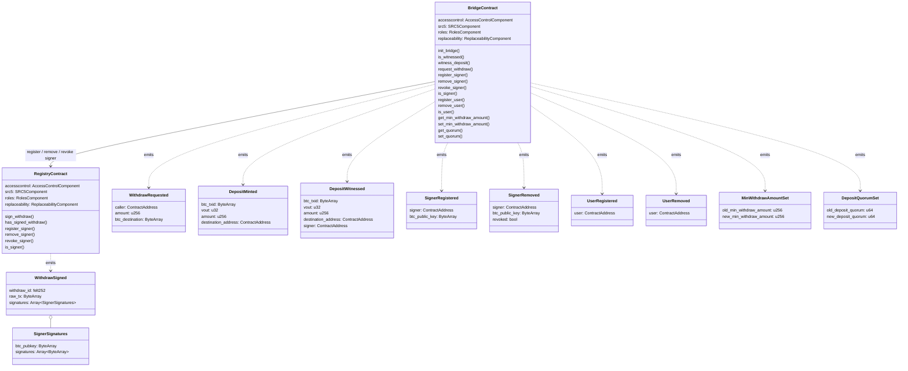

# strkBTC Bridge - Specs

## Diagram



---

## Token Contract

The `strkBTC` token is a Starkgate-compatible mintable ERC-20 token deployed on Starknet
representing wrapped Bitcoin. It is minted when a BTC deposit is confirmed by the bridge
and burned when a user requests a BTC withdrawal, with a single designated
`permitted_minter` address (the bridge contract) authorized to mint and burn.

---

## Registry Contract

The `Registry` contract manages the set of authorized Bitcoin bridge signers
and records their Bitcoin signatures for pending withdrawals. When a signer submits
signatures for a withdrawal transaction, the contract emits an event containing the
aggregated signatures from all signers who have signed so far, enabling off-chain relayers
to broadcast the fully-signed Bitcoin transaction.

### Types

#### WithdrawId

A unique identifier for a withdrawal, computed as a Poseidon hash of the raw transaction.

```rust
type WithdrawId = felt252;
```

#### BtcPublicKeyHash

A Poseidon hash of a serialized BTC public key, used as a compact key for storage lookups
and the blacklist.

```rust
type BtcPublicKeyHash = felt252;
```

### Storage

```rust
struct Storage {
    accesscontrol: AccessControlComponent::Storage,
    src5: SRC5Component::Storage,
    roles: RolesComponent::Storage,
    replaceability: ReplaceabilityComponent::Storage,
    /// Maps a signer's Starknet address to their BTC public key.
    signer_to_public_key: Map<ContractAddress, ByteArray>,
    /// Blacklisted BTC public key hashes (revoked signers). Blacklisted keys are
    /// excluded from signature aggregation.
    btc_public_key_blacklist: Map<BtcPublicKeyHash, bool>,
    /// Withdrawal signature state, grouped in a storage node.
    withdraw_signatures: WithdrawSignaturesState,
}

struct WithdrawSignaturesState {
    /// For each withdraw_id, the ordered list of BTC public keys that have signed.
    withdraw_id_to_signers: Map<WithdrawId, Vec<ByteArray>>,
    /// For each (withdraw_id, btc_pubkey_hash) pair, the list of DER signatures submitted.
    /// The btc_pubkey_hash is the Poseidon hash of the serialized BTC public key ByteArray.
    withdraw_id_to_signatures: Map<(WithdrawId, felt252), Vec<ByteArray>>,
}
```

### Structs and Events

#### SignerSignatures

Bundles a signer's BTC public key with their submitted signatures for a single withdrawal.

```rust
pub struct SignerSignatures {
    pub btc_pubkey: ByteArray,
    pub signatures: Array<ByteArray>,
}
```

#### WithdrawSigned

Emitted each time a signer calls `sign_withdraw`. Contains the full raw Bitcoin transaction
and the aggregated signatures from every signer who has signed so far.

```rust
pub struct WithdrawSigned {
    #[key] pub withdraw_id: felt252,
    pub raw_tx: ByteArray,
    pub signatures: Array<SignerSignatures>,
}
```

### Constructor

```rust
fn constructor(
    ref self: ContractState,
    governance_admin: ContractAddress,
    upgrade_delay: u64,
)
```

#### Logic

1. Initializes `RolesComponent` with `governance_admin`.
2. Initializes `ReplaceabilityComponent` with `upgrade_delay`.

### Constants

| Constant | Value | Description |
|----------|-------|-------------|
| `MAX_SIGNATURE_LENGTH` | 160 | Maximum length of a single hex-encoded DER Bitcoin signature (73 bytes × 2 + 14 bytes buffer) |
| `MAX_SIGNATURES_COUNT` | 40 | Maximum number of signatures (one per input UTXO) per `sign_withdraw` call |

### Functions

#### sign_withdraw

```rust
fn sign_withdraw(ref self: ContractState, raw_tx: ByteArray, signatures: Span<ByteArray>)
```

Records the caller's Bitcoin signatures for a withdrawal identified by `raw_tx`, then
emits `WithdrawSigned` with the full aggregated signature set.

##### Access

Only callable by a registered signer.

##### Logic

1. Asserts caller is a registered signer (`signer_to_public_key` entry is non-empty).
2. Asserts `raw_tx` is non-empty.
3. Asserts `signatures` is non-empty.
4. Asserts `signatures` span length ≤ `MAX_SIGNATURES_COUNT` (40).
5. Asserts each signature length ≤ `MAX_SIGNATURE_LENGTH` (160 hex characters, i.e. 80 bytes).
6. Reads caller's `btc_pubkey` from `signer_to_public_key`.
7. Computes `withdraw_id = poseidon_hash(raw_tx)`.
8. Computes `btc_pubkey_hash = poseidon_hash(btc_pubkey)`.
9. If this is the first signature for this `btc_pubkey_hash` on this `withdraw_id`, appends `btc_pubkey` to `withdraw_id_to_signers[withdraw_id]`.
10. Overwrites `withdraw_id_to_signatures[(withdraw_id, btc_pubkey_hash)]` with the new `signatures` (replacing any previous submission).
11. Aggregates all pubkey-signature pairs for `withdraw_id` into `Array<SignerSignatures>`, skipping any signers whose `btc_pubkey_hash` is blacklisted.
12. Emits `WithdrawSigned { withdraw_id, raw_tx, signatures }`.

---

#### has_signed_withdraw

```rust
fn has_signed_withdraw(
    self: @ContractState, raw_tx: ByteArray, btc_pubkey: ByteArray,
) -> bool
```

Returns `true` if the owner of `btc_pubkey` has submitted at least one signature for the
withdrawal identified by `raw_tx`.

##### Logic

1. Computes `withdraw_id = poseidon_hash(raw_tx)`.
2. Computes `btc_pubkey_hash = poseidon_hash(btc_pubkey)`.
3. Returns `withdraw_id_to_signatures[(withdraw_id, btc_pubkey_hash)].len() > 0`.

---

#### register_signer

```rust
fn register_signer(
    ref self: ContractState, signer: ContractAddress, btc_pubkey: ByteArray,
)
```

Registers a new signer, associating their Starknet address with their Bitcoin public key.

##### Access

Only callable by an address with the `APP_GOVERNOR` role.

##### Logic

1. Asserts caller holds `APP_GOVERNOR`.
2. Computes `btc_pubkey_hash = poseidon_hash(btc_pubkey)`.
3. Asserts `btc_public_key_blacklist[btc_pubkey_hash]` is `false` (key was not revoked).
4. Writes `btc_pubkey` into `signer_to_public_key[signer]`.

---

#### remove_signer

```rust
fn remove_signer(ref self: ContractState, signer: ContractAddress)
```

Deregisters a signer.

##### Access

Only callable by an address with the `APP_GOVERNOR` role.

##### Logic

1. Asserts caller holds `APP_GOVERNOR`.
2. Clears `signer_to_public_key[signer]` (writes empty `ByteArray`).

---

#### revoke_signer

```rust
fn revoke_signer(ref self: ContractState, signer: ContractAddress)
```

Deregisters a signer and blacklists their BTC public key, preventing their previously
submitted signatures from being included in future signature aggregations.

##### Access

Only callable by an address with the `APP_GOVERNOR` role.

##### Logic

1. Asserts caller holds `APP_GOVERNOR`.
2. Reads `btc_pubkey` from `signer_to_public_key[signer]`.
3. Computes `btc_pubkey_hash = poseidon_hash(btc_pubkey)`.
4. Sets `btc_public_key_blacklist[btc_pubkey_hash] = true`.
5. Calls `remove_signer(signer)` to deregister the signer.

---

#### is_signer

```rust
fn is_signer(self: @ContractState, signer: ContractAddress) -> bool
```

Returns `true` if `signer` is currently registered (i.e., has a non-empty BTC public key).

### Errors

| Error | Description |
|-------|-------------|
| `ONLY_SIGNER` | Caller is not a registered signer |
| `EMPTY_SIGS` | `signatures` span is empty |
| `EMPTY_RAW_TX` | `raw_tx` is empty |
| `PUBLIC_KEY_BLACKLISTED` | BTC public key has been revoked and cannot be re-registered |
| `SIG_TOO_LONG` | A signature exceeds maximum length (160 hex characters) |
| `TOO_MANY_SIGS` | Too many signatures in span (max 40) |

---

## Bridge Contract

The `Bridge` contract is the core coordination point of the strkBTC system. It manages
the two-way flow between Bitcoin and Starknet:

- **Deposits**: A quorum of authorized signers call `witness_deposit` to attest that a
  BTC deposit occurred on-chain. Once the quorum threshold is reached, the contract mints
  the corresponding `strkBTC` tokens to the destination address.
- **Withdrawals**: An authorized user burns their `strkBTC` by calling `request_withdraw`,
  which emits a `WithdrawRequested` event. Off-chain signers observe this event and co-sign
  the corresponding Bitcoin transaction via the Registry contract.

### Constants

| Name | Value | Description |
|------|-------|-------------|
| `MIN_QUORUM` | `2` | Minimum allowed quorum value |

### Types

#### DepositId

A unique identifier for a deposit, computed as a Poseidon hash of the deposit parameters.

```rust
pub type DepositId = felt252;
```

#### BtcPublicKeyHash

A Poseidon hash of a serialized BTC public key, used as a compact key for storage lookups.

```rust
pub type BtcPublicKeyHash = felt252;
```

#### DepositWitnesses

Tracks which signers have witnessed a deposit and whether it has been minted.

```rust
struct DepositWitnesses {
    witnesses: IterableMap<ContractAddress, bool>,
    minted: bool,
}
```

### Storage

```rust
struct Storage {
    accesscontrol: AccessControlComponent::Storage,
    src5: SRC5Component::Storage,
    roles: RolesComponent::Storage,
    replaceability: ReplaceabilityComponent::Storage,
    /// Whether the bridge has been initialized via `init_bridge`.
    bridge_initialized: bool,
    /// Dispatcher of the strkBTC token contract (mint/burn target).
    mintable_token: IMintableTokenDispatcher,
    /// Dispatcher of the Registry contract.
    registry: IRegistryDispatcher,
    /// Number of signer witnesses required to trigger a mint.
    deposit_quorum: u64,
    /// Minimum amount of strkBTC that can be withdrawn (configurable).
    min_withdraw_amount: u256,
    /// Whether a given Starknet address is an authorized user (for withdrawals).
    authorized_users: Map<ContractAddress, bool>,
    /// Maps a signer's Starknet address to their BTC public key.
    signer_to_public_key: Map<ContractAddress, ByteArray>,
    /// For each deposit, the set of signers who have witnessed it and its mint status.
    deposit_id_to_witnesses: Map<DepositId, DepositWitnesses>,
    /// Maps a BTC public key hash to the Starknet address of the signer who registered it.
    public_key_hash_to_signer: Map<BtcPublicKeyHash, ContractAddress>,
    /// Whether a given signer Starknet address is blacklisted (revoked).
    signer_blacklist: Map<ContractAddress, bool>,
}
```

### Events

#### WithdrawRequested

Emitted when an authorized user burns `strkBTC` to initiate a Bitcoin withdrawal. Off-chain
signers listen for this event and co-sign the corresponding Bitcoin transaction.

```rust
pub struct WithdrawRequested {
    #[key] pub caller: ContractAddress,
    pub amount: u256,
    #[key] pub btc_destination: ByteArray,
}
```

#### DepositMinted

Emitted when a deposit reaches the quorum threshold and the corresponding `strkBTC` tokens
are minted.

```rust
pub struct DepositMinted {
    #[key] pub btc_txid: ByteArray,
    pub vout: u32,
    pub amount: u256,
    #[key] pub destination_address: ContractAddress,
}
```

#### DepositWitnessed

Emitted each time a signer calls `witness_deposit`, regardless of whether quorum is reached.

```rust
pub struct DepositWitnessed {
    #[key] pub btc_txid: ByteArray,
    pub vout: u32,
    pub amount: u256,
    #[key] pub destination_address: ContractAddress,
    #[key] pub signer: ContractAddress,
}
```

#### SignerRegistered

Emitted when a signer is registered via `register_signer`.

```rust
pub struct SignerRegistered {
    #[key] pub signer: ContractAddress,
    #[key] pub btc_public_key: ByteArray,
}
```

#### SignerRemoved

Emitted when a signer is removed via `remove_signer` or revoked via `revoke_signer`.
The `revoked` field distinguishes between the two: `false` for removal, `true` for revocation.

```rust
pub struct SignerRemoved {
    #[key] pub signer: ContractAddress,
    #[key] pub btc_public_key: ByteArray,
    pub revoked: bool,
}
```

#### UserRegistered

Emitted when a user is registered via `register_user`.

```rust
pub struct UserRegistered {
    #[key] pub user: ContractAddress,
}
```

#### UserRemoved

Emitted when a user is removed via `remove_user`.

```rust
pub struct UserRemoved {
    #[key] pub user: ContractAddress,
}
```

#### MinWithdrawAmountSet

Emitted when the minimum withdrawal amount is updated via `set_min_withdraw_amount`.

```rust
pub struct MinWithdrawAmountSet {
    pub old_min_withdraw_amount: u256,
    pub new_min_withdraw_amount: u256,
}
```

#### DepositQuorumSet

Emitted when the deposit quorum is updated via `set_quorum`.

```rust
pub struct DepositQuorumSet {
    pub old_deposit_quorum: u64,
    pub new_deposit_quorum: u64,
}
```

### Constructor

```rust
fn constructor(
    ref self: ContractState,
    governance_admin: ContractAddress,
    upgrade_delay: u64,
)
```

#### Logic

1. Initializes `RolesComponent` with `governance_admin`.
2. Initializes `ReplaceabilityComponent` with `upgrade_delay`.
3. Sets `bridge_initialized` to `false`.

---

### init_bridge

```rust
fn init_bridge(
    ref self: ContractState,
    token_address: ContractAddress,
    registry_address: ContractAddress,
    quorum: u64,
    min_withdraw_amount: u256,
)
```

Initializes the bridge with the token, registry, quorum, and minimum withdrawal amount.
Can only be called once.

##### Access

Only callable by an address with the `APP_GOVERNOR` role.

##### Logic

1. Asserts caller holds `APP_GOVERNOR`.
2. Asserts `bridge_initialized` is `false`.
3. Asserts `token_address` is non-zero.
4. Asserts `registry_address` is non-zero.
5. Asserts `quorum >= MIN_QUORUM`.
6. Stores `mintable_token` dispatcher, `registry` dispatcher, `quorum`, and `min_withdraw_amount`.
7. Sets `bridge_initialized` to `true`.

### Helpers

#### compute_deposit_id

```rust
fn compute_deposit_id(
    btc_txid: @ByteArray,
    vout: u32,
    amount: u256,
    destination_address: ContractAddress,
) -> DepositId
```

Serializes all four deposit parameters and returns their Poseidon hash. Used internally
by both `is_witnessed` and `witness_deposit` to derive a canonical deposit identifier.

### Functions

#### is_witnessed

```rust
fn is_witnessed(
    self: @ContractState,
    btc_txid: ByteArray,
    vout: u32,
    amount: u256,
    destination_address: ContractAddress,
    signer: ContractAddress,
) -> bool
```

Returns `true` if `signer` has already witnessed the specified deposit.

##### Logic

1. Computes `deposit_id = compute_deposit_id(btc_txid, vout, amount, destination_address)`.
2. Returns `deposit_id_to_witnesses[deposit_id].has_witnessed(signer)`.

---

#### witness_deposit

```rust
fn witness_deposit(
    ref self: ContractState,
    btc_txid: ByteArray,
    vout: u32,
    amount: u256,
    destination_address: ContractAddress,
)
```

Records the caller's witness for a deposit and emits `DepositWitnessed`. If the validated
witness count reaches the quorum threshold and the deposit has not already been minted,
mints `amount` of `strkBTC` to `destination_address` and emits `DepositMinted`.

##### Access

Only callable by a registered signer. Bridge must be initialized.

##### Logic

1. Asserts caller is a registered signer (`signer_to_public_key[caller]` is non-empty).
2. Asserts bridge is initialized.
3. Computes `deposit_id = compute_deposit_id(btc_txid, vout, amount, destination_address)`.
4. Calls `deposit_id_to_witnesses[deposit_id].mark_witnessed(caller)`.
5. Emits `DepositWitnessed { btc_txid, vout, amount, destination_address, signer: caller }`.
6. Computes `validated_witness_count` via `deposit_id_to_witnesses[deposit_id].get_validated_witness_count(signer_blacklist)`.
7. If `validated_witness_count >= quorum` and `!deposit_id_to_witnesses[deposit_id].is_minted()`:
   a. Calls `deposit_id_to_witnesses[deposit_id].mark_minted(true)`.
   b. Calls `mintable_token.permissioned_mint(destination_address, amount)`.
   c. Emits `DepositMinted { btc_txid, vout, amount, destination_address }`.

---

#### request_withdraw

```rust
fn request_withdraw(ref self: ContractState, amount: u256, btc_destination: ByteArray)
```

Burns `amount` of the caller's `strkBTC` and emits `WithdrawRequested` to signal
off-chain signers to construct and sign the corresponding Bitcoin transaction.

##### Access

Only callable by an authorized user.

##### Logic

1. Asserts caller is an authorized user (`authorized_users[caller]` is `true`).
2. Asserts bridge is initialized.
3. Asserts `amount >= min_withdraw_amount`.
4. Asserts `btc_destination` is non-empty.
5. Calls `mintable_token.permissioned_burn(caller, amount)`.
6. Emits `WithdrawRequested { caller, amount, btc_destination }`.

---

#### register_signer

```rust
fn register_signer(
    ref self: ContractState,
    signer: ContractAddress,
    btc_public_key: ByteArray,
)
```

Authorizes a signer to witness deposits and registers their BTC public key in the
Registry contract. A signer can be re-registered with a new public key (the previous
public key mapping is overwritten).

##### Access

Only callable by an address with the `APP_GOVERNOR` role. Bridge must be initialized.

##### Logic

1. Asserts caller holds `APP_GOVERNOR`.
2. Asserts bridge is initialized.
3. Asserts `signer` is non-zero.
4. Asserts `btc_public_key` is non-empty.
5. Computes `btc_public_key_hash = compute_hash(btc_public_key)`.
6. Asserts `public_key_hash_to_signer[btc_public_key_hash]` is zero (BTC key not already in use).
7. Asserts `signer_blacklist[signer]` is `false` (signer was not revoked).
8. If `signer` already has a registered public key, clears the old `public_key_hash_to_signer` entry.
9. Writes `signer_to_public_key[signer] = btc_public_key`.
10. Writes `public_key_hash_to_signer[btc_public_key_hash] = signer`.
11. Calls `registry.register_signer(signer, btc_public_key)` on the Registry contract.
12. Emits `SignerRegistered { signer, btc_public_key }`.

---

#### remove_signer

```rust
fn remove_signer(ref self: ContractState, signer: ContractAddress)
```

Removes a signer's authorization to witness deposits and removes them from the Registry.
The signer is not blacklisted and their previous witnesses remain valid.

##### Access

Only callable by an address with the `APP_GOVERNOR` role. Bridge must be initialized.

##### Logic

1. Asserts caller holds `APP_GOVERNOR`.
2. Asserts bridge is initialized.
3. Calls `internal_remove_signer(signer, revoked: false)`.

---

#### revoke_signer

```rust
fn revoke_signer(ref self: ContractState, signer: ContractAddress)
```

Removes a signer's authorization and blacklists their Starknet address. Blacklisted signers'
witnesses are excluded from the validated witness count, effectively invalidating their
previous witnesses for any deposits that have not yet been minted.

##### Access

Only callable by an address with the `APP_GOVERNOR` role. Bridge must be initialized.

##### Logic

1. Asserts caller holds `APP_GOVERNOR`.
2. Asserts bridge is initialized.
3. Calls `internal_remove_signer(signer, revoked: true)`.

---

#### is_signer

```rust
fn is_signer(self: @ContractState, signer: ContractAddress) -> bool
```

Returns `true` if `signer` is currently authorized to witness deposits (i.e., has a
non-empty `ByteArray` entry in `signer_to_public_key`).

---

#### register_user

```rust
fn register_user(ref self: ContractState, user: ContractAddress)
```

Authorizes a new user to request withdrawals.

##### Access

Only callable by an address with the `APP_GOVERNOR` role. Bridge must be initialized.

##### Logic

1. Asserts caller holds `APP_GOVERNOR`.
2. Asserts bridge is initialized.
3. Asserts `user` is non-zero.
4. Asserts `authorized_users[user]` is `false` (user not already registered).
5. Sets `authorized_users[user] = true`.
6. Emits `UserRegistered { user }`.

---

#### remove_user

```rust
fn remove_user(ref self: ContractState, user: ContractAddress)
```

Revokes a user's authorization to request withdrawals.

##### Access

Only callable by an address with the `APP_GOVERNOR` role. Bridge must be initialized.

##### Logic

1. Asserts caller holds `APP_GOVERNOR`.
2. Asserts bridge is initialized.
3. Asserts `authorized_users[user]` is `true` (user must be registered).
4. Sets `authorized_users[user] = false`.
5. Emits `UserRemoved { user }`.

---

#### is_user

```rust
fn is_user(self: @ContractState, user: ContractAddress) -> bool
```

Returns `true` if `user` is currently authorized to request withdrawals.

---

#### get_min_withdraw_amount

```rust
fn get_min_withdraw_amount(self: @ContractState) -> u256
```

Returns the current minimum withdrawal amount. Bridge must be initialized.

---

#### set_min_withdraw_amount

```rust
fn set_min_withdraw_amount(ref self: ContractState, min_withdraw_amount: u256)
```

Updates the minimum withdrawal amount. Can be set to zero to effectively disable the
minimum check.

##### Access

Only callable by an address with the `APP_GOVERNOR` role. Bridge must be initialized.

##### Logic

1. Asserts caller holds `APP_GOVERNOR`.
2. Asserts bridge is initialized.
3. Reads `old_min_withdraw_amount` from storage.
4. Asserts `old_min_withdraw_amount != min_withdraw_amount` (value must actually change).
5. Writes `min_withdraw_amount` to storage.
6. Emits `MinWithdrawAmountSet { old_min_withdraw_amount, new_min_withdraw_amount: min_withdraw_amount }`.

---

#### get_quorum

```rust
fn get_quorum(self: @ContractState) -> u64
```

Returns the current quorum value. Bridge must be initialized.

---

#### set_quorum

```rust
fn set_quorum(ref self: ContractState, quorum: u64)
```

Updates the quorum value.

##### Access

Only callable by an address with the `APP_GOVERNOR` role. Bridge must be initialized.

##### Logic

1. Asserts caller holds `APP_GOVERNOR`.
2. Asserts bridge is initialized.
3. Asserts `quorum >= MIN_QUORUM`.
4. Reads `old_deposit_quorum` from storage.
5. Asserts `old_deposit_quorum != quorum` (value must actually change).
6. Writes `quorum` to `deposit_quorum` in storage.
7. Emits `DepositQuorumSet { old_deposit_quorum, new_deposit_quorum: quorum }`.

### DepositWitnesses Methods

Methods on `StoragePath<DepositWitnesses>` (read-only):

#### has_witnessed

```rust
fn has_witnessed(self: StoragePath<DepositWitnesses>, signer: ContractAddress) -> bool
```

Returns `true` if `signer` has a `true` witness entry. Checks that the entry is present
and its value is `true`.

#### is_minted

```rust
fn is_minted(self: StoragePath<DepositWitnesses>) -> bool
```

Returns the value of the `minted` flag for this deposit.

#### get_validated_witness_count

```rust
fn get_validated_witness_count(
    self: StoragePath<DepositWitnesses>,
    signer_blacklist: StoragePath<Map<ContractAddress, bool>>,
) -> u64
```

Returns the number of witnesses for a deposit that are not blacklisted. Iterates all
witnesses in the `IterableMap` and counts only those where `witnessed` is `true` and the
signer is not in `signer_blacklist`.

Methods on `StoragePath<Mutable<DepositWitnesses>>` (mutable):

#### mark_witnessed

```rust
fn mark_witnessed(ref self: StoragePath<Mutable<DepositWitnesses>>, signer: ContractAddress)
```

Writes `true` to `witnesses[signer]`.

#### mark_minted

```rust
fn mark_minted(ref self: StoragePath<Mutable<DepositWitnesses>>, minted: bool)
```

Writes the `minted` flag.

### Helpers

#### internal_remove_signer

```rust
fn internal_remove_signer(ref self: ContractState, signer: ContractAddress, revoked: bool)
```

Shared implementation for `remove_signer` and `revoke_signer`.

##### Logic

1. Reads `btc_public_key` from `signer_to_public_key[signer]`.
2. Asserts `btc_public_key` is non-empty (signer must be registered).
3. Computes `btc_public_key_hash = compute_hash(btc_public_key)`.
4. Clears `signer_to_public_key[signer]` (writes empty `ByteArray`).
5. Clears `public_key_hash_to_signer[btc_public_key_hash]` (writes zero).
6. If `revoked`:
   a. Sets `signer_blacklist[signer] = true`.
   b. Calls `registry.revoke_signer(signer)` on the Registry contract.
7. If not `revoked`:
   a. Calls `registry.remove_signer(signer)` on the Registry contract.
8. Emits `SignerRemoved { signer, btc_public_key, revoked }`.

### Errors

| Error | Description |
|-------|-------------|
| `BRIDGE_NOT_INITIALIZED` | Bridge has not been initialized via `init_bridge` |
| `BRIDGE_ALREADY_INITIALIZED` | `init_bridge` has already been called |
| `ONLY_SIGNER` | Caller is not a registered signer |
| `ONLY_USER` | Caller is not an authorized user |
| `DUP_PUBLIC_KEY` | BTC public key is already registered to another signer |
| `SIGNER_BLACKLISTED` | Signer's Starknet address has been revoked and cannot be re-registered |
| `SIGNER_NOT_REGISTERED` | Signer is not currently registered (on removal/revocation) |
| `USER_ALREADY_REGISTERED` | User is already registered |
| `USER_NOT_REGISTERED` | User is not currently registered (on removal) |
| `ZERO_SIGNER` | Provided signer address is the zero address |
| `ZERO_USER` | Provided user address is the zero address |
| `ZERO_PUBLIC_KEY` | Provided BTC public key is empty |
| `ZERO_TOKEN_ADDRESS` | Token address passed to `init_bridge` is zero |
| `ZERO_REGISTRY_ADDRESS` | Registry address passed to `init_bridge` is zero |
| `ZERO_BTC_DESTINATION` | BTC destination address is empty |
| `INVALID_QUORUM` | Quorum is below `MIN_QUORUM` |
| `INVALID_WITHDRAW_AMOUNT` | Withdrawal amount is below `min_withdraw_amount` |
| `MIN_WITHDRAW_AMOUNT_NOT_CHANGED` | New minimum withdrawal amount is the same as the current value |
| `QUORUM_NOT_CHANGED` | New quorum is the same as the current value |
